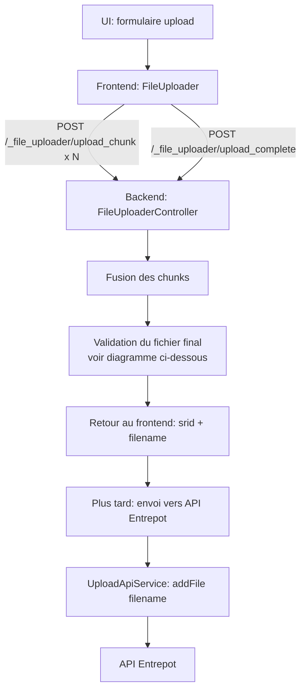
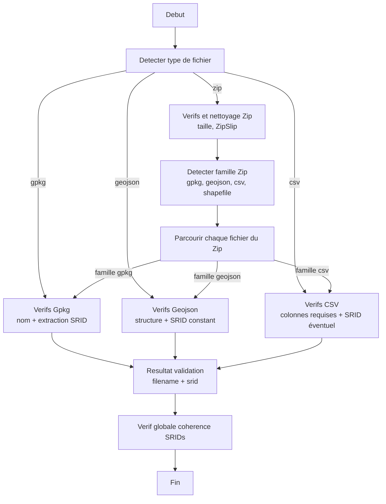

# Téléversement de fichiers en morceaux

Ce document décrit le fonctionnement général du téléversement de fichiers (GeoPackage `.gpkg`, GeoJSON `.geojson`, CSV `.csv` et archive `.zip`) utilisé lors du dépôt d'une donnée.

## Objectif

- Permettre le téléversement de gros fichiers en découpant en morceaux (chunks) pour limiter l'impact des coupures réseau.
- Valider le fichier final côté serveur (format, SRID, contraintes ZIP etc.) avant de le rendre disponible aux étapes suivantes.
- Conserver les noms d'origine (nom du zip et chemins relatifs des fichiers extraits) lors de l'envoi vers l'API Entrepôt.

## Parcours global (vue d'ensemble)

1. Le navigateur découpe le fichier en chunks et envoie chaque chunk au backend.
2. Quand tous les chunks sont envoyés, le navigateur appelle l'endpoint de finalisation.
3. Le backend fusionne les chunks, valide le fichier final, puis répond avec un JSON minimal.
4. Le frontend stocke la valeur de retour `filename` (utilisée ensuite comme `data_upload_path`).
5. Plus tard, ce chemin est utilisé pour récupérer le fichier local et l'envoyer vers l'API Entrepôt.

## Diagramme

### Flux global

---

### Validation

## Endpoints backend

- `POST /_file_uploader/upload_chunk`
    - Reçoit un chunk et l'enregistre sur disque.
    - Réponse: `{ "index": <n>, "numBytes": <taille_chunk> }`.

- `POST /_file_uploader/upload_complete`
    - Déclenche la fusion des chunks, puis la validation du fichier final.
    - Réponse: `{ "srid": <EPSG>, "filename": <chemin_relatif> }`.

Le contrat (routes + forme du JSON) est volontairement stable car il est consommé par le frontend.

## Stockage et nommage

- Les chunks sont stockés dans un répertoire dédié au `uuid` d'upload.
- Lors de la finalisation, le backend reconstitue un fichier final et l'enregistre sous le nom d'origine fourni par l'utilisateur (afin d'avoir un nom lisible et stable pour la suite).
- La valeur `filename` renvoyée est un chemin relatif (sous le répertoire d'uploads) et c'est cette valeur qui circule ensuite vers l'intégration Entrepôt.

## Validation côté serveur

Règles principales :

- Taille maximale : 2 Go.
- Extensions acceptées : `.gpkg`, `.geojson`, `.csv`, `.sql` et `.zip`.
- GeoPackage (`.gpkg`) :
    - Extraction des SRID via lecture SQLite (tables GeoPackage).
    - Les noms de tables doivent respecter: `^[a-zA-Z_][ A-Za-z0-9_]*$`.
    - La donnée doit avoir un SRID cohérent (un seul EPSG détecté).
- GeoJSON (`.geojson`) :
    - Validation minimale de structure JSON/GeoJSON.
    - SRID forcé à `EPSG:4326` (RFC 7946).
- CSV (`.csv`) :
    - Le fichier doit contenir une ligne d'en-tête (noms de colonnes).
    - Le fichier est valide si l'en-tête contient soit :
        - une colonne géométrie nommée `json`, `geom`, `the_geom`, `wkb` ou `wkt`,
        - soit deux colonnes coordonnées dont les noms sont dans :
            - longitude : `lon`, `x`, `longitude`
            - latitude : `lat`, `y`, `latitude`
    - SRID :
        - si les colonnes explicites `lon|longitude` ET `lat|latitude` sont présentes, le serveur renvoie `EPSG:4326`,
        - sinon le serveur renvoie un SRID vide (le SRID est choisi côté UI).
- SQL (`.sql`) :
    - Validation minimale (côté serveur) : fichier non vide, lisible, sans caractère NUL.
    - La validation sémantique du SQL est déléguée à l'API Entrepôt.
    - SRID : non extrait (SRID vide, choix côté UI).

| format       | extension(s)                                                                           | zip obligatoire | multi-fichier | plusieurs fichiers autorisé à la fois |
| ------------ | -------------------------------------------------------------------------------------- | --------------- | ------------- | ------------------------------------- |
| `GeoPackage` | gpkg\*                                                                                 | non             | non           | oui                                   |
| `GeoJSON`    | geojson\*                                                                              | non             | non           | oui                                   |
| `Shapefile`  | shp*, shx*, dbf\*, prj, sbn, sbx, fbn, fbx, ain, aih, ixs, mxs, atx, shp.xml, cpg, qix | oui             | oui           | oui                                   |
| `CSV`        | csv\*                                                                                  | non             | non           | oui                                   |
| `SQL`        | sql\*                                                                                  | non             | non           | oui                                   |

- Les extensions avec un asterisque sont obligatoires, les autres sont optionnelles.
- Multi-fichier : le format est constitué de plusieurs fichiers (ex. shapefile).
- Zip obligatoire : les fichiers doivent être obligatoirement dans un zip.
- Dans un ZIP, une seule famille est autorisée : GeoPackage, GeoJSON, CSV, SQL ou Shapefile (pas de mélange).

### Politique ZIP (permissive + mutation)

- Une archive `.zip` est acceptée, et le serveur ne conserve que les entrées faisant partie d'une famille supportée (GeoPackage, GeoJSON, CSV, SQL, Shapefile).
- Les autres fichiers sont supprimés de l'archive (mutation) pour ne conserver que le contenu utile.
- Des garde-fous existent pour limiter les comportements dangereux (chemins suspects, tailles/ratios trop élevés, etc.).
- Le ZIP ne doit contenir qu'une seule « famille » de données : uniquement des `.gpkg` OU uniquement des `.geojson` OU uniquement des `.csv` OU uniquement des `.sql` OU uniquement un Shapefile (pas de mélange).
- Les SRID sont extraits sur l'ensemble des `.gpkg` présents : le SRID doit rester cohérent entre plusieurs couches du gpkg.

## Envoi vers l'API Entrepôt

Lorsqu'on envoie un ZIP:

- Le serveur extrait l'archive localement et parcourt récursivement les fichiers de la famille détectée (`.gpkg`, `.geojson`, `.csv` ou shapefile).
- Chaque fichier est envoyé à l'API Entrepôt en conservant son chemin relatif dans l'archive.
    - Exemple: une entrée `dossier/sous-dossier/data.gpkg` est envoyée comme `path=data/dossier/sous-dossier/data.gpkg`.

Cette conservation des chemins permet de préserver la structure fournie par l'utilisateur.

## Nettoyage

Les fichiers déposés sous `var/data/` sont temporaires. Un nettoyage périodique supprime les uploads anciens (actuellement ~24h) pour éviter l'accumulation.
