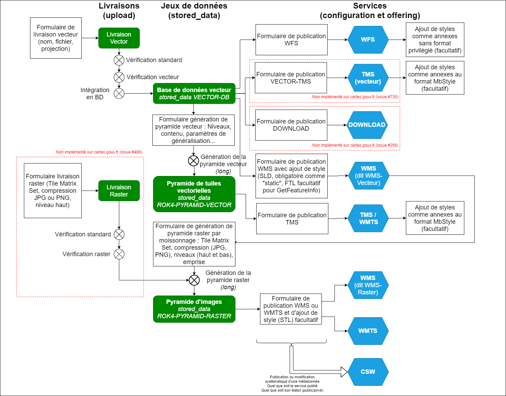

# Workflows

Les interfaces d'alimentation et de diffusion de cartes.gouv.fr acceptent en entrée des données vecteur et raster et permettent de produire en sortie des services (flux) de type :
* Web Feature Service (WFS) - flux vecteur
* Web Map Service (WMS) - flux raster généré à la volée ou à partir d'une pyramide d'image précalculée
* Web Map Tile Service (WMTS) - flux raster provenant d'une pyramide d'images
* Tile Map Service (TMS) - flux vecteur à partir d'une pyramide de tuiles vectorielles précalculée

