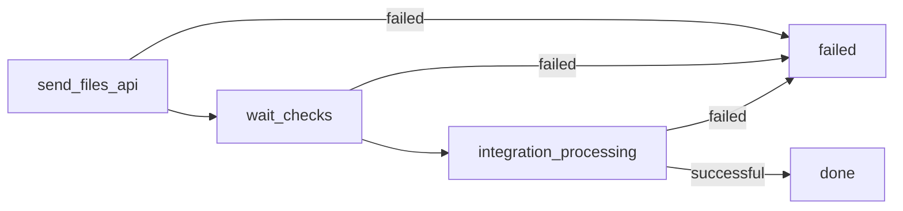

# Workflow : intégration upload vecteur (VECTOR-DB)

Ce document décrit le fonctionnement actuel de notre workflow d'intégration d'un upload vecteur. Le frontend fait un polling régulier qui déclenche une route symfony qui orchestre pour le processus.

## Objectif

- Envoyer les fichiers à l'API Entrepôt.
- Attendre les checks automatiques côté Entrepôt.
- Lancer le traitement d'intégration en base (VECTOR-DB).

## Principe du workflow

- Le workflow contient une liste d'étapes fixes et ordonnées.
- Chaque étape a un statut : waiting, in_progress, successful, failed.
- Le backend calcule l'état global à partir des statuts des étapes.
- Une seule étape avec effet de bord peut être exécutée à la fois.
- L'étape courante est la première étape non successful.

## Diagramme de progression



## Étapes et règles de statut

Le workflow a 3 étapes fixes. Chaque étape est un couple (nom, statut).

- send_files_api
    - successful : upload en CLOSED ou CHECKING
    - waiting : upload en OPEN
    - failed : autre statut

- wait_checks
    - failed : au moins un check en FAILED
    - in_progress : au moins un check en ASKED ou IN_PROGRESS, ou upload en CHECKING
    - successful : au moins un check en PASSED et aucun failed
    - waiting : aucun check lancé et upload pas en CHECKING

- integration_processing
    - waiting : tags proc_int_id et vectordb_id absents
    - failed : un seul des deux tags présent
    - in_progress : processing en CREATED, WAITING ou PROGRESS
    - successful : processing SUCCESS et stored_data vectordb en GENERATED
    - in_progress : processing SUCCESS et stored_data en CREATED, GENERATING ou MODIFYING
    - failed : autres cas

## Fonctionnement pas à pas (backend)

1. Création de l'upload
    - Le backend déclare une livraison côté Entrepôt (type VECTOR, srs, name).
    - Il ajoute les tags : data_upload_path, datasheet_name, producer, production_year.

2. Calcul de progression
    - Le backend calcule un tableau progress (étape -> statut).
    - Il détermine l'étape courante (première étape non successful).
    - Il écrit les tags :
        - integration_progress (json encodé)
        - integration_current_step (index de l'étape courante)

3. Avancement contrôlé
    - Si l'étape courante est en waiting, le backend peut avancer d'une étape.
    - Le workflow n'exécute jamais plus d'une action avec effet de bord par appel.

4. Actions avec effet de bord
    - send_files_api : envoi des fichiers à Entrepôt, calcul des md5, puis fermeture de l'upload.
    - integration_processing : création et lancement du processing d'intégration en base.

5. Fin du workflow
    - Quand les 3 étapes sont successful, l'upload est supprimé.

## Tags utilisés

- upload
    - data_upload_path
    - datasheet_name
    - producer
    - production_year
    - proc_int_id
    - vectordb_id
    - integration_progress
    - integration_current_step
- stored_data (VECTOR-DB)
    - upload_id
    - proc_int_id
    - datasheet_name
    - producer (optionnel)
    - production_year (optionnel)

## Exemple de integration_progress

```json
{
    "send_files_api": "successful",
    "wait_checks": "successful",
    "integration_processing": "in_progress"
}
```
